# Food Data Use Case

In this use case, a user wants to convert their food data from Open Food Facts to rdf using existing vocabularies if any are suitable. The use case shows how the process could go if our tool was used instead of looking up vocabularies and transforming data manually. The use case serves for introducing features that could be usable for the tool. The use cases should be a motivation for creation of the tool and a preview of the main functional requirements.

The data for each product are around thousand lines long json with a lot of information that provide little meaning to a non-author person. Look in `food.json` for an example. An example of the data for noodles and its most important fields are shown below. The user wants to convert these to rdf and ignore the rest.

```json
{
    "product": {
        "_id": "0737628064502",
        "product_name": "Thai peanut noodle kit includes stir-fry rice noodles & thai peanut seasoning",
        "countries": "United States",
        "ingredients": [
            {
                "has_sub_ingredients": "yes",
                "id": "en:noodle",
                "percent_estimate": 53.8461538461538,
                "percent_max": 100,
                "percent_min": 7.69230769230769,
                "rank": 1,
                "text": "Noodle"
            }
        ],
        "nutriments": {
            "calcium": 0.038,
            "calcium_100g": 0.038,
            "calcium_serving": 0.0198,
            "calcium_unit": "mg",
            "calcium_value": 38
        },
        "...": "..."
    }
}
```

The use case uses food product data. There are a few vocabularies capable of representing a food product even sometimes along with nutrition information and ingredients - [FoodOn](https://foodon.org/), [The FoodOntology](http://akswnc7.informatik.uni-leipzig.de/dstreitmatter/archivo/purl.org/foodontology/2020.06.10-203447/foodontology_type=generatedDocu.html#introduction) and some ontologies for categorizing food products (but mostly without propertySets, just thesaurus) - [AGROVOC](https://agrovoc.fao.org/browse/agrovoc/en/page/c_5274).

The use case has two sub use cases which share the input data but differ in the output. In the former one, the user uses any vocabulary terms that the tool can find to represent various entitySets and propertySets. In the latter, the user decides to not reuse vocabularies much and insteads wants to generate new vocabulary terms based on the data (create a new vocabulary (vocabularies) and represent parts of the data using them). The reason might be that the aforementioned vocabularies have little propertySets, have different focus - e.g. agricultural - or are too complex to understand.

## Common Part

### Loading Data

The user loads a json with product data into the tool. Since there may be a lot of entitySets which are not important and do not need to be shown initially so that the data view is not cluttered, the users selects what is shown. The user also selects which parts of data are not to be converted to rdf. A visualization is shown of the picture below where the user picks what to load from the input data.

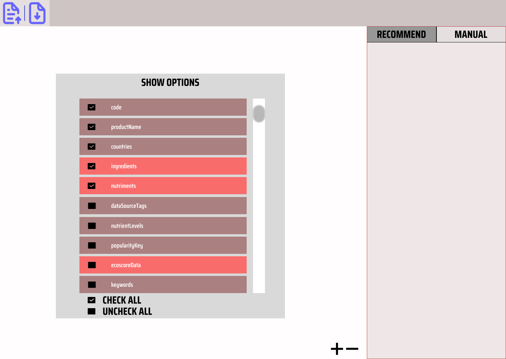

### Mapping Countries PropertySet

When the data is loaded, the user wants to see what is loaded graphically. This is shown in the next picture where the loaded data are converted to a schema representing the data.


There is a graphical representation of entitySets (light red rectangles) with their literalSet propertySets (dark red rectangles) and propertySets to other entitySets (arrows). The user should be able to browse the data behind the schema which is visually represented with the eye buttons.

The user wants to start representing the data with known vocabularies - either through tool recommendations how the data can be matched to vocabulary terms or themself manually.

In the picture below, there is only one recommendation called "Countries". The user selects it. For any recommendation the user typically wants to know what is the recommendation about (which propertySet, entitySet) and what vocabulary and its terms were found matching the data. It would also be ideal if the user can browse the vocabulary and the terms directly in the app in case of not dereferencable URIs or for convenience because they must decide whether the vocabulary and specifically the term fits the data. This is represented by the popup windows in the picture below. The main window also contains information what method the recommendation was created from. The option of browsing experience is indicated by the eye buttons and the box with rdf tutrle showcasing an example of the vocabulary or term propertySets which corresponds to one such eye button being clicked by the user (highlighted by green color).

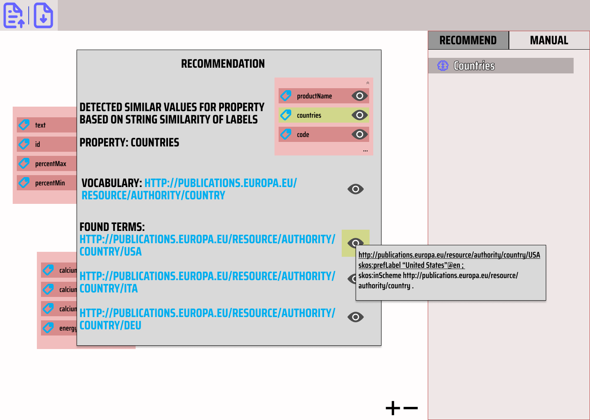

The user likes the recommendation based on the introductory information and gets more details about how the vocabulary matches with the data. This is shown in the picture below.

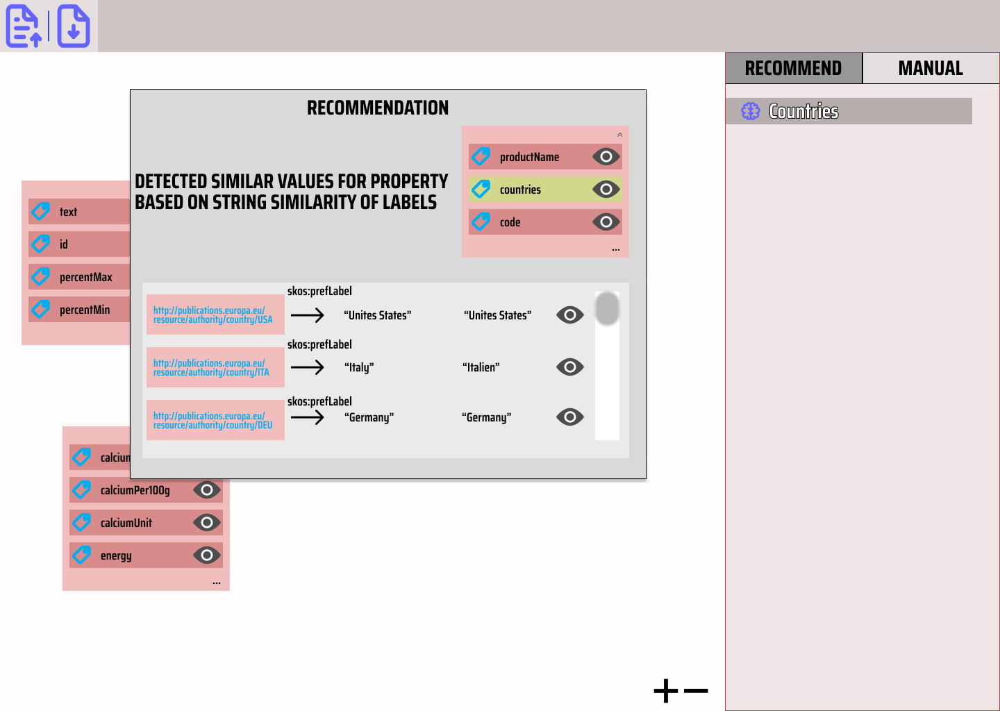

Lastly, the user wants to see the change of the schema if they go through the recommendation. This is shown in the picture below where new things added to the schema have pink/purple color.


Updated schema can be seen on the picture below. Any change from the input data (e.g. changed propertySets, added entitySets) are shown in pink/purple color. This is where the two sub use cases split.


## Sub Use Case With Generated Vocabulary

### Mapping Nutriments PropertySet

The following picture shows the starting schema for this sub use case.
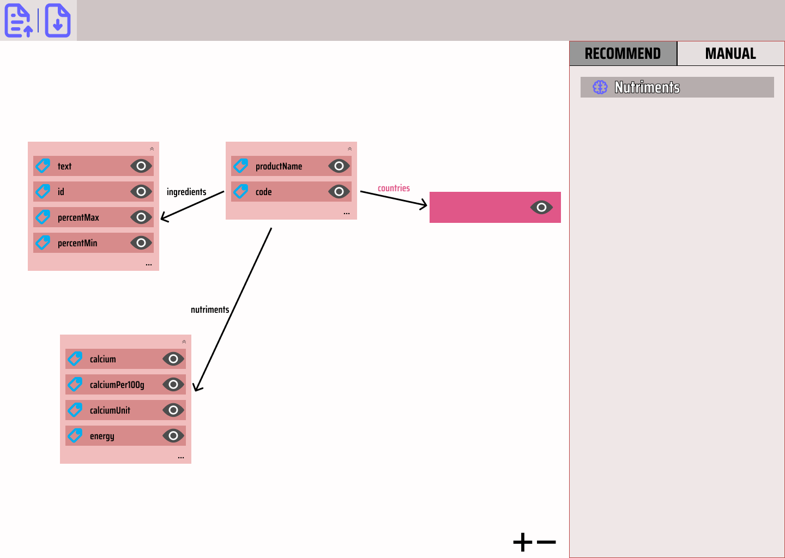

The user selects `Nutriments` recommendation which found matching "[nutrients](http://aims.fao.org/aos/agrovoc/c_5274)" term in AGROVOC thesaurus for "nutriments" propertySet. The recommendation introduction window can be seen below.


Again the user is interested about what the found term matched and wants to preview the propertySet or its whole vocabulary (visualised as simple turtle excerpt). The user inspects it but based on the definition does not found the terms matching. However, rather than "nutrients" he founds a related term while browsing the term propertySets which fits the match - "[food composition](http://aims.fao.org/aos/agrovoc/c_10961)" and manually adds the entitySet to this class (shown on the picture below).

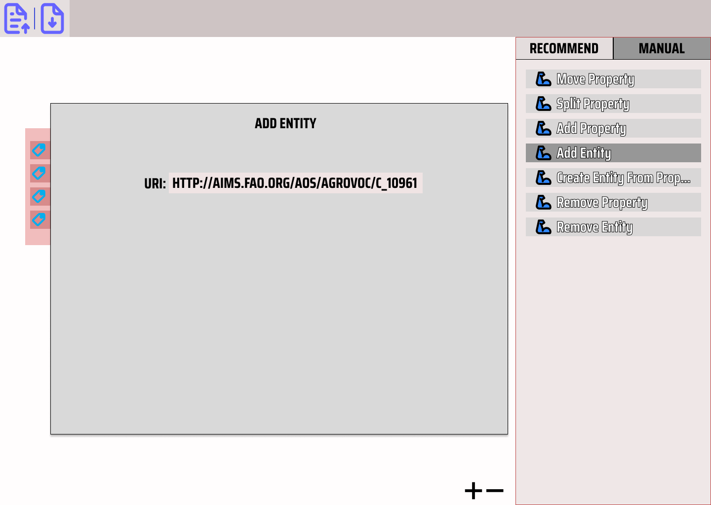

The right side menu also shows other examples manual tasks that the user could want to perform to adjust the schema per their bidding.

The next picture shows the updated schema.


The user still wants to convert the nutrients propertySets to known vocabulary propertySets but there are no recommendations. If no vocabulary terms can be found, there is an option of creating a new vocabulary and assigning its terms in the schema. But before doint that the user does not want to have so many propertySets of one component (e.g. "calcium", "calciumPer100g", "calciumUnit") for all food components hanged on one entitySet. Instead each such component could have its own entitySet. This can be done manually and the end result is shown in the picture below.


On the next frame, the tool detected a recommendation to convert a unit for food composition values from literalSet to URI in library. The user prefers having a unit represented by a vocabulary entitySet with URI rather than a literalSet.

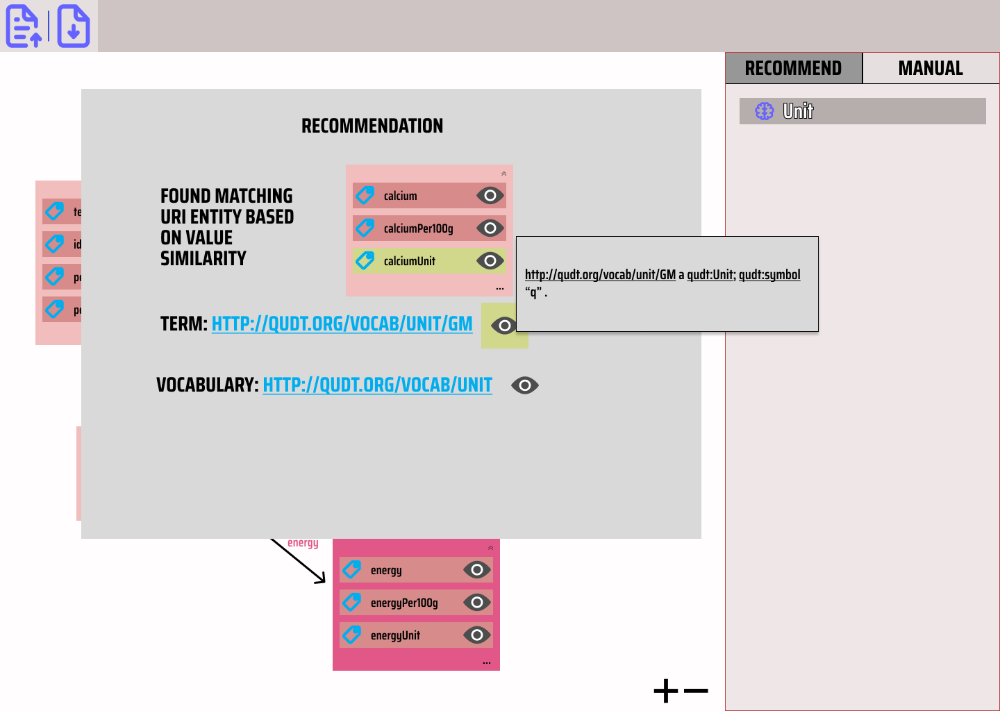

Specifically, "g" literalSet to [gram entitySet](http://qudt.org/vocab/unit/GM). Part of the recommendation is the link to the vocabulary of the found matching entitySet which can be previewed as well as the entitySet itself. The user has a chance to inspect what the found term means and whether to use it or something else from the library.

The user proceeds with the recommendation. Next there is again a detail view showing how the match was found (method) and values that were matched. This is very simple in this case, since the literalSets matched by string comparison on literalSets.

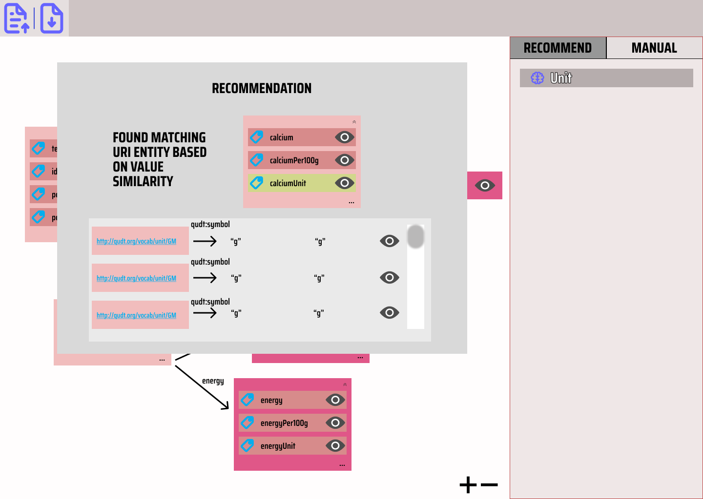

The user is also interested in how the schema is affected by this recommendation and the tool obliges.

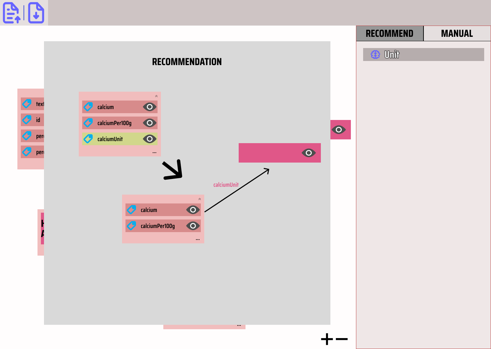

The next picture shows the whole updated schema.

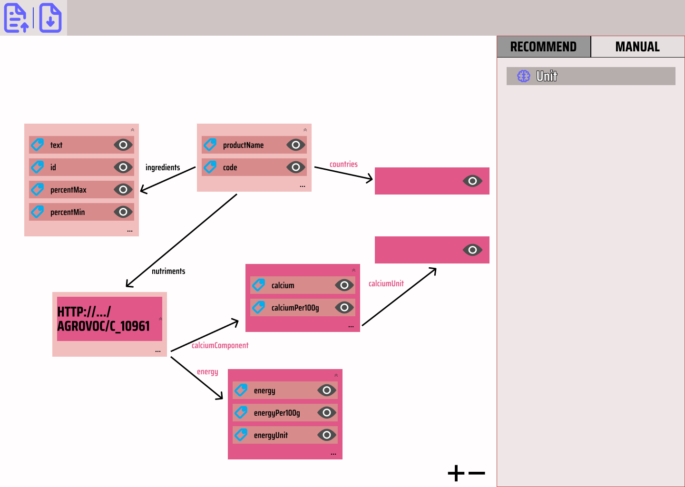

The same can be done for energy or any other food components. The end result is shown below.


Now the user is satisfied with the schema and wants to get the output rdf where the unmapped propertySets should be a part of new generated vocabularies. The tool detects all unmapped propertySets and provides a way to create new vocabularies and map them remaining unmapped propertySets to them. In the picture below, the app shows all unmapped propertySets in red. If the user does not want to create any vocabulary, each propertySet would have a default vocabulary prefix which is shown in the right side menu.

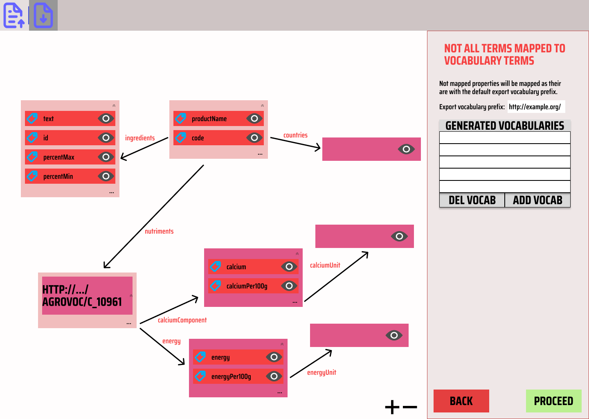

The user wants to create a food vocabulary to represent any food product or dish along with its ingredients and nutrients. Therefore, they select the option to add a vocabulary. The user needs to select a prefix URI for the vocabulary (or more but for simplicity there is only one), select terms from the schema which would be a part of the vocabulary and add triples enriching, completing and describing the vocabulary. How this process could be done is illustrated in the next pictures.

The picture below gives an example of how this part is expected to work. There is a summary for selected terms and an option for adding vocabulary prefix.


The user defines the vocabulary prefix in the picture below.
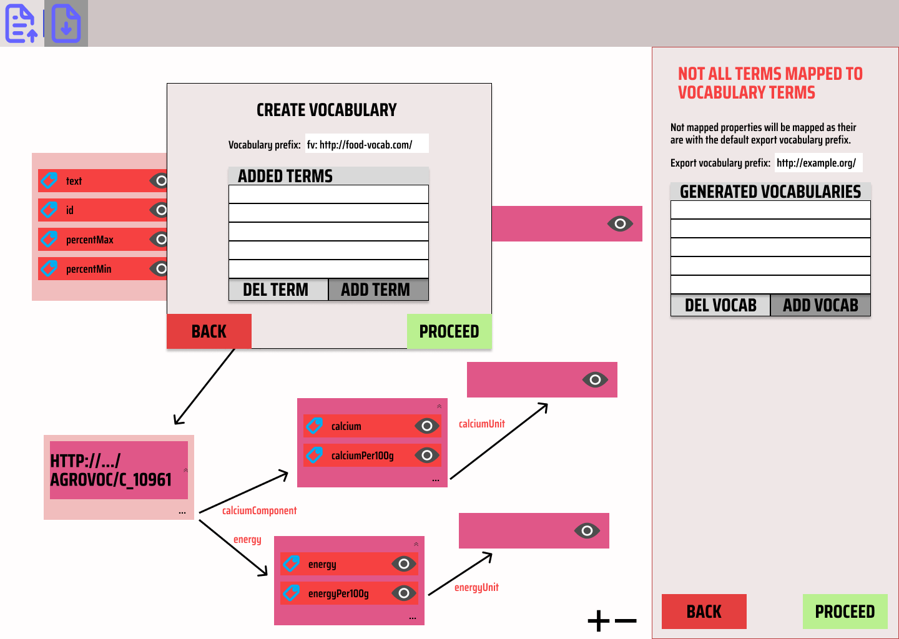

Then the user adds the propertySets that should be a part of the new food vocabulary (Green color means selection on the picture below).
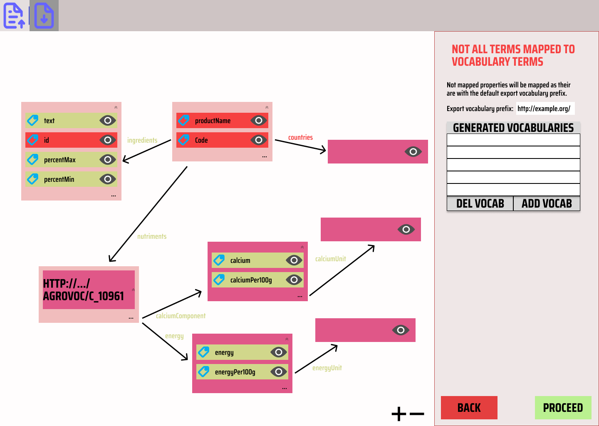

The next picture shows the summary of selected terms. The user could rename or otherwise adjust the terms here.
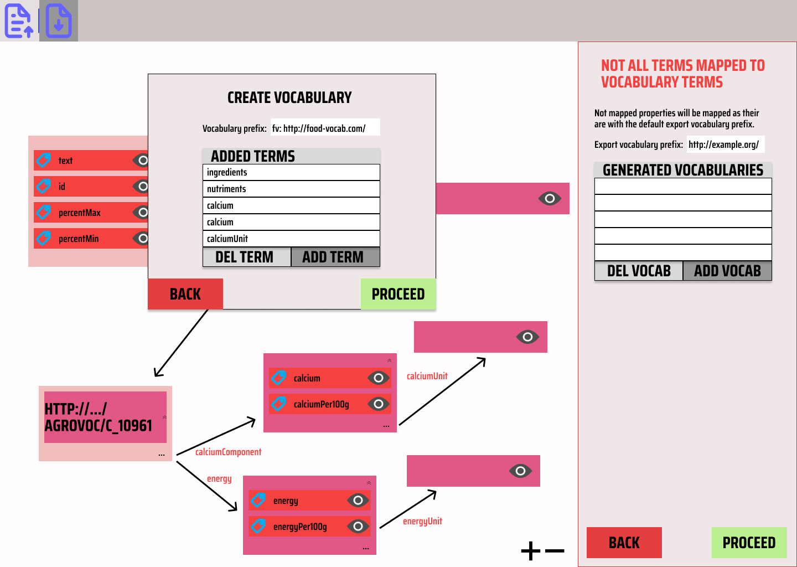

The next picture shows a simple example for adding more triples to the vocabulary. The user could define e.g. a class for food, add description and labels for the selected propertySets from previous step.
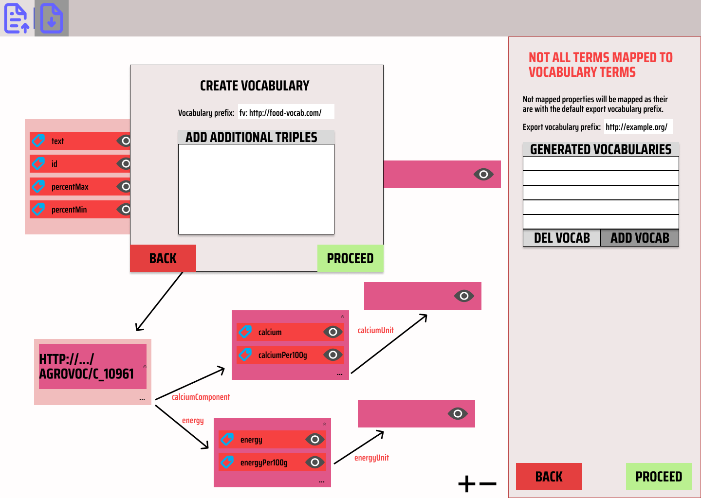

The user could also want to add the new vocabulary to the catalog of vocabularies which the application uses for creating recommendations. This is illustrated in the picture below.


The last picture shows the updated schema with terms from the newly created vocabulary.
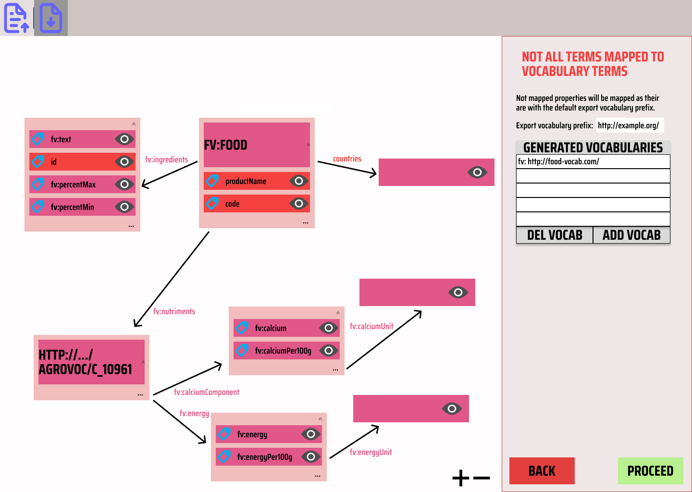

The user now can create vocabulary for the remaining unmapped terms or manually assign them to other vocabularies or generate output rdf with the default export vocabulary prefix applying to the remaining unmapped terms.

## Sub Use Case With Vocabularies

The following picture shows the starting schema for this sub use case. The user wants to map the most of propertySets and entitySets to known vocabulary terms. The user selects `Ingredient` recommendation in the right side menu.


A recommendation windows appears and the user can see that the recommendation is about the "ingredients" propertySet and that it matched term "containsIngredient" from Food Ontology vocabulary. The picture representing this is below. The user previews the term which is simply illustrated with the rectangle with turtle rdf.


The user likes the recommendation and proceeds. The next window would show the details of the matching method as in recommendations before but that is not shown in the next picture. The user wants to see what effect the recommendation has on the overall schema. This is shown in the picture below. The recommendations do not have to be just about a single propertySet as it was before but also about a set of terms that are somehow linked. The example here is that the recommendation recommends not just adding a propertySet "food:containsIngredient" but also the type for food and an ingredient to the schema.


The next picture shows the updated schema.

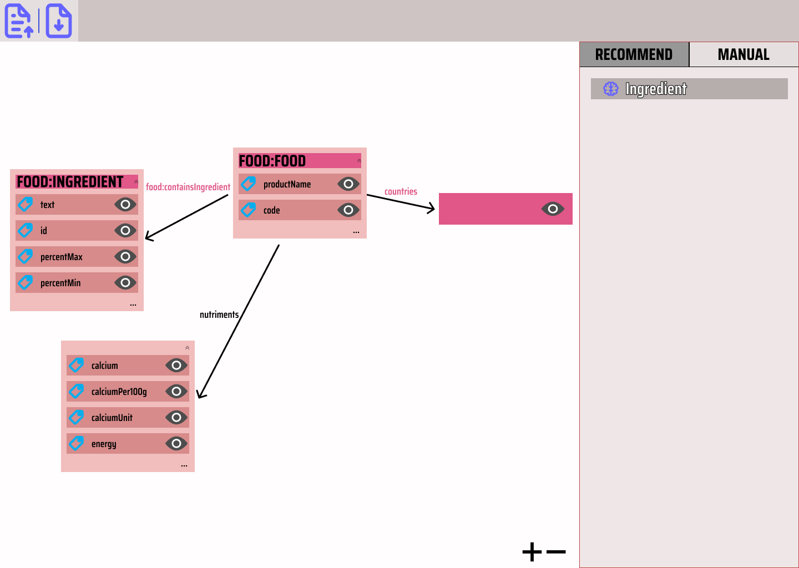

The user continues with the food recommendations and gets to the state portrayed below. They could find "schema:NutritionInformation" and map the food component propertySets themselves or it could be mostly done with a recommendation if the tool offered it. The user could also continue with the propertySets of the ingredient or food to map them to known vocabulary terms and generate output rdf or just generate the rdf as is similarly how it is done in the previous sub use case.

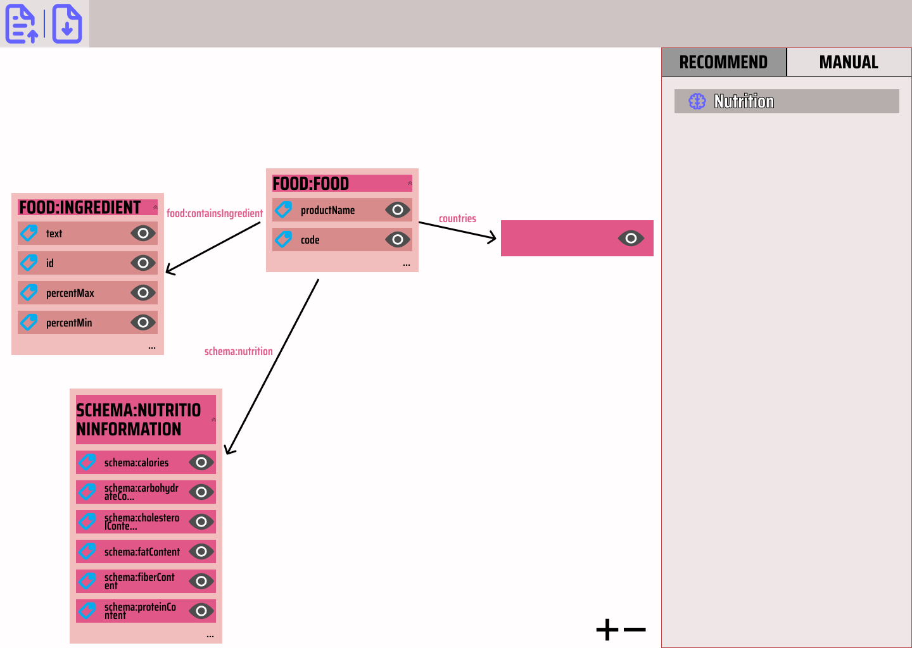
